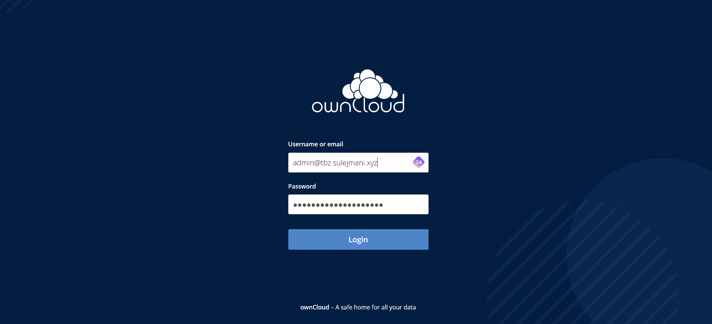
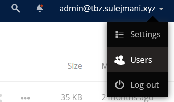
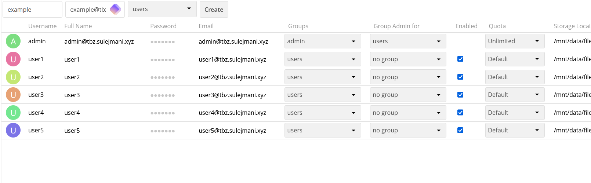
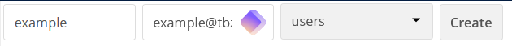
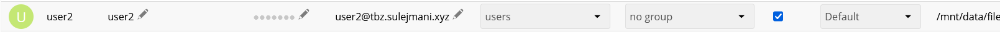
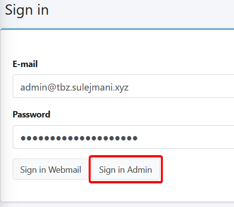
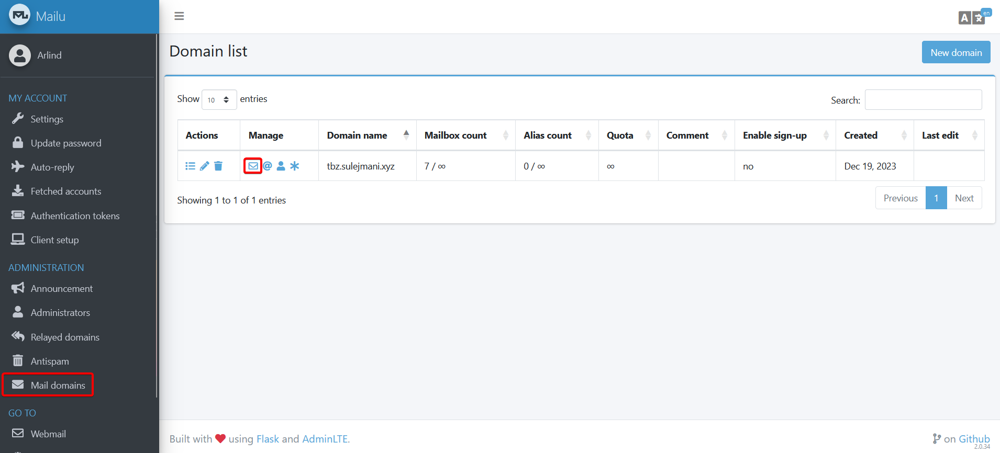
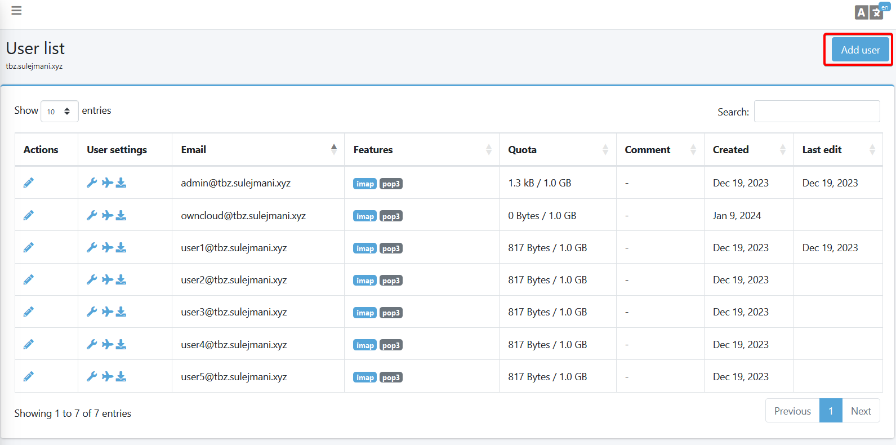
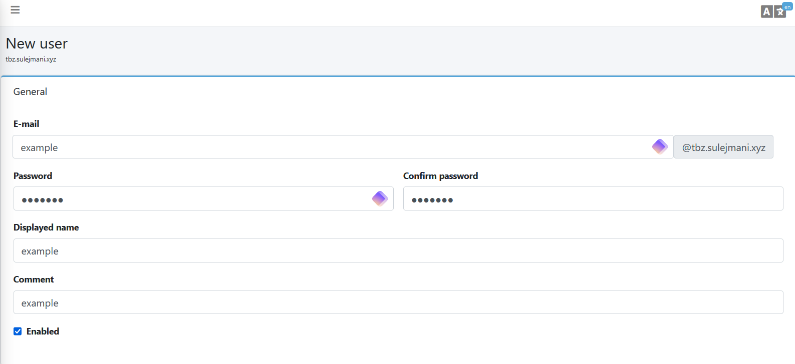
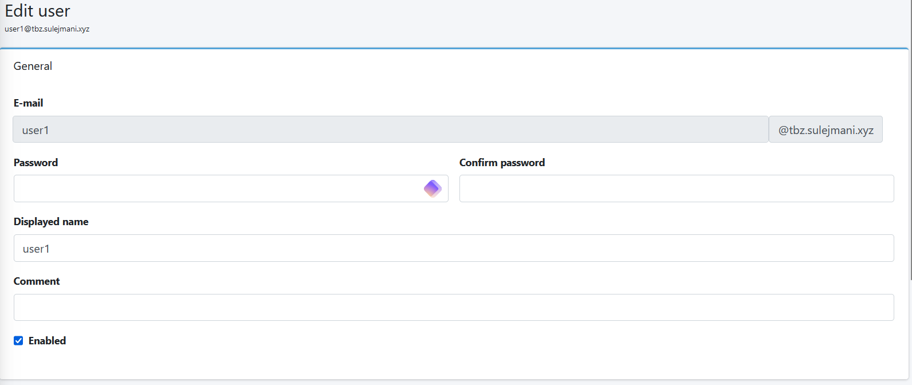

# Betriebsdokumentation

Diese Betriebsdokumentation bietet einen umfassenden Überblick über unsere Backup-Docker-Umgebung und enthält alle wichtigen Informationen, die für Systemadministratoren relevant sind.

## Inhaltsverzeichnis

- [Betriebsdokumentation](#betriebsdokumentation)
  - [Inhaltsverzeichnis](#inhaltsverzeichnis)
  - [Datensicherungskonzept](#datensicherungskonzept)
  - [Backup](#backup)
  - [Restore](#restore)
  - [Watchtower](#watchtower)
  - [OwnCloud](#owncloud)
    - [Benutzer verwalten](#benutzer-verwalten)
      - [Benutzer erstellen](#benutzer-erstellen)
      - [Benutzer bearbeiten (Passwort-Wiederherstellung)](#benutzer-bearbeiten-passwort-wiederherstellung)
  - [Mail](#mail)
    - [Benutzer verwalten](#benutzer-verwalten-1)
      - [Benutzer erstellen](#benutzer-erstellen-1)
    - [Benutzer bearbeiten (Passwort-Wiederherstellung)](#benutzer-bearbeiten-passwort-wiederherstellung-1)

## Datensicherungskonzept


In unserem Datensicherungskonzept nutzen wir vier Docker-Stacks, wobei einer davon ein Proxy ist. Durch unseren Proxy ist der einzige offene Port Port 80 und 443, wobei Port 80 ausschliesslich für die Weiterleitung zum Port 443 verwendet wird. Auf diese Weise stellen wir sicher, dass alle Kommunikation verschlüsselt ist. Dies bietet einen erheblichen Vorteil, da unsere Mailserver nur intern kommunizieren. Somit ist es praktisch unmöglich, dass wir über Mailangriffe gefährdet werden, da unsere externe Kommunikation praktisch nicht existiert. Auf diese Weise gewährleisten wir, dass unsere Kommunikation sicher ist.

Mit Hilfe von Watchtower führen wir jeden Freitagabend Updates an unseren Containern durch.

Unsere Backups werden täglich um 20:00 Uhr durchgeführt, gesteuert durch ein Bash-Skript. Weitere Details zum Bash-Skript finden Sie in den folgenden Abschnitten. Es ist wichtig zu erwähnen, dass unser Bash-Skript durch einen Cronjob gesteuert wird und sowohl lokale HDD- als auch Tape-Backups sowie Remote-Backups durchführt. Alle Protokolle sind im Verzeichnis `/var/log/tbz` zu finden.

## Backup

Jeden Freitag um 17:00 Uhr werden Backups gemäss einem Cronjob erstellt.

Der Cronjob ist wie folgt konfiguriert:

```bash
0 17 * * 5 /bin/bash /home/arlind/docker/backup.sh
```

Die Ausführung erfolgt über das folgende Skript:

```bash
#!/bin/bash
timestamp=$(date +%Y_%m_%d-%H_%M_%S)
log_dir="/var/log/tbz"
log_file1="$log_dir/${timestamp}_backup-hdd.log"
log_file2="$log_dir/${timestamp}_backup-tape.log"
log_file_remote="$log_dir/${timestamp}_backup-remote.log"
mkdir -p "$log_dir"
exec > >(tee -a "$log_file1") 2>&1
source_dir="/home/arlind/docker/"
local_backup_dir1="/home/arlind/backup-hdd"
local_backup_dir2="/home/arlind/backup-tape"

# Perform the first local backup using rsync and log the output
rsync -avh --delete "$source_dir" "$local_backup_dir1"
exec > >(tee -a "$log_file2") 2>&1

# Perform the second local backup using rsync and log the output
rsync -avh --delete "$source_dir" "$local_backup_dir2"
exec > >(tee -a "$log_file_remote") 2>&1

remote_user="arlind"
remote_host="localhost"
remote_backup_dir="/home/arlind/backup-remote"

rsync -avh --delete -e "ssh -i /home/arlind/.ssh/ssh-key" "$source_dir" "$remote_user@$remote_host:$remote_backup_dir"
```
Dieses Skript erstellt eine identische Kopie aller Dateien im Verzeichnis `/home/arlind/docker` und überträgt sie auf zwei verschiedene Speichermedien sowie in die Cloud über SSH, um eine sichere Datenübertragung zu gewährleisten.

Die Daten werden unverschlüsselt gespeichert, da ownCloud und Mailu die Daten verschlüsselt speichern.

Wenn ein Backup sofort erstellt werden muss, kann man sich direkt über SSH mit dem Server verbinden und das Skript `backup.sh` im Verzeichnis `/home/arlind/docker` ausführen.

Dies kann mit dem folgenden Befehl erreicht werden:

```bash
sudo bash /home/arlind/docker/backup.sh
```

## Restore

Das Wiederherstellungsskript ist recht einfach und besteht aus verschiedenen mv-Befehlen sowie einem scp -r-Befehl. Bevor jedoch alles wiederhergestellt wird, werden verschiedene Schritte ausgeführt. Zunächst wird ein Skript namens stop.sh ausgeführt, das alle relevanten Docker-Container herunterfährt.

Nachdem die Container heruntergefahren wurden, wird das gesamte Verzeichnis bereinigt, um Probleme während der Wiederherstellung zu vermeiden.

Anschliessend wählt der Benutzer die Wiederherstellungsmethode aus, und der entsprechende Vorgang wird durchgeführt. Nach Abschluss der Wiederherstellung wird das Skript start.sh ausgeführt, um alle Docker-Container wieder zu starten.

```bash
#!/bin/bash

timestamp=$(date +%Y_%m_%d-%H_%M_%S)
log_dir="/var/log/tbz"
log_file1="$log_dir/${timestamp}_restore-hdd.log"
log_file2="$log_dir/${timestamp}_restore-tape.log"
log_file_remote="$log_dir/${timestamp}_restore-remote.log"

remote_user="arlind"
remote_host="localhost"
remote_backup_dir="/home/arlind/backup-remote/*"

bash /home/arlind/docker/stop.sh

echo "Choose a script to execute:"
echo "1. Execute restore from HDD"
echo "2. Execute restore from tape"
echo "3. Execute restore from remote"
read choice

# Function to log messages to the appropriate log file
log_message() {
  local log_file="$1"
  local message="$2"
  echo "$(date '+%Y-%m-%d %H:%M:%S') - $message" >> "$log_file"
}

case "$choice" in
  1)
    log_message "$log_file1" "Restoring from HDD"
    rm -rf /home/arlind/docker/mailu
    rm -rf /home/arlind/docker/watchtower
    rm -rf /home/arlind/docker/owncloud
    rm -rf /home/arlind/docker/traefik
    cp -r /home/arlind/backup-hdd/* /home/arlind/docker/
    ;;
  2)
    log_message "$log_file2" "Restoring from tape"
    rm -rf /home/arlind/docker/mailu
    rm -rf /home/arlind/docker/watchtower
    rm -rf /home/arlind/docker/owncloud
    rm -rf /home/arlind/docker/traefik
    cp -r /home/arlind/backup-tape/* /home/arlind/docker/
    ;;
  3)
    log_message "$log_file_remote" "Restoring from remote"
    rm -rf /home/arlind/docker/mailu
    rm -rf /home/arlind/docker/watchtower
    rm -rf /home/arlind/docker/owncloud
    rm -rf /home/arlind/docker/traefik
    scp -r -i /home/arlind/.ssh/ssh-key "$remote_user@$remote_host:$remote_backup_dir" /home/arlind/docker/ >> "$log_file_remote" 2>&1
    ;;
  *)
    log_message "$log_file1" "Invalid choice. Please enter 1, 2, or 3."
    ;;
esac

bash /home/arlind/docker/start.sh
```

Um das Skript auszuführen, muss man sich wie gewohnt über SSH auf dem Server anmelden. In dem Verzeichnis /home/arlind/docker befindet sich eine Datei namens restore.sh, die ohne weitere Argumente ausgeführt werden kann. Nach dem Ausführen des Skripts mit dem Befehl:

```bash
sudo bash /home/arlind/docker/restore.sh
```
wird ein Menü angezeigt, das es ermöglicht, die Wiederherstellungsmethode auszuwählen: 1. für HDD, 2. für Tape und 3. für Remote.

Hier ist ein Beispiel:

```bash
sudo ./restore.sh
Choose the backup destination:
1. HDD
2. Tape
3. Remote
Enter your choice (1/2/3): 1
```
Nachdem die Auswahl getroffen wurde und Enter gedrückt wurde, werden alle Protokolle während der Wiederherstellung angezeigt.

## Watchtower

Unser Watchtower-Container aktualisiert alle unsere Docker-Container jeden Freitag um 20:00 Uhr. Hier ist die Docker-Compose-Datei, die die Konfiguration für den Watchtower definiert:

```yml
version: "3.8"
services:
  watchtower:
    image: containrrr/watchtower:latest
    container_name: watchtower
    networks:
      proxy:
        ipv4_address: 172.16.1.1
    environment:
      - TZ=Europe/Zurich
      - WATCHTOWER_INCLUDE_STOPPED=true
      - WATCHTOWER_REVIVE_STOPPED=false
      - WATCHTOWER_RUN_ONCE=false
      - WATCHTOWER_CLEANUP=true
      - WATCHTOWER_SCHEDULE=0 0 20 * * 5
    volumes:
      - /var/run/docker.sock:/var/run/docker.sock
    restart: on-failure

networks:
  proxy:
    external: true
```

Wie Sie sehen können, kann der Zeitplan jederzeit angepasst werden. Es wird jedoch nicht empfohlen, den Zeitplan zu ändern, da wir Updates nicht sofort ausführen möchten, um potenzielle Probleme zu vermeiden.

## OwnCloud

### Benutzer verwalten

Um Benutzer in OwnCloud zu verwalten, müssen Sie sich zunächst im Administrationsportal unter `owncloud.tbz.sulejmani.xyz` anmelden.

- **Benutzer:** admin@tbz.sulejmani.xyz
- **Passwort:** X4eebe4pxyVS&kP+zjxg
- **TOTP:** BFHDISN333N6OMVN

Der Administrationsnutzer ist durch 2FA gesichert. Nachdem Sie Benutzername und Passwort eingegeben haben, müssen Sie sich mit dem 2FA-Code anmelden.




Nach der Anmeldung können Sie oben rechts auf Ihren Benutzernamen klicken und zu "Benutzer" navigieren.



Dort angekommen, können Sie neue Benutzer erstellen oder vorhandene bearbeiten.



#### Benutzer erstellen

Um einen neuen Benutzer zu erstellen, klicken Sie auf die Schaltfläche "Benutzer hinzufügen" in der Mitte des Fensters.



Hier können Sie den Benutzernamen, die E-Mail-Adresse und die Gruppe definieren. Die Gruppe sollte immer "Benutzer" sein, da wir nur einen zentralen Administratorbenutzer in der Gruppe "Administratoren" haben sollten.

#### Benutzer bearbeiten (Passwort-Wiederherstellung)

Um einen Benutzer zu bearbeiten, folgen Sie dem gleichen Weg, um zu den Benutzereinstellungen zu gelangen.



Dort können Sie verschiedene Einstellungen ändern, wie z.B. Benutzername, Passwort, Gruppe, Aktivierung, Quota, usw.

## Mail

### Benutzer verwalten

Um Benutzer in Mailu zu erstellen, melden Sie sich zunächst im administrationsportal unter `mail.tbz.sulejmani.xyz` an.

**Benutzer:** admin@tbz.sulejmani.xyz
**Passwort:** X4eebe4pxyVS&kP+zjxg
**TOTP:** BFHDISN333N6OMVN



Es ist wichtig, dass Sie sich im Administrationsportal anmelden und nicht im Webmail.

Navigieren Sie anschliessend zur Benutzerliste.



Klicken Sie zuerst auf "Mail domains" und dann auf das Briefsymbol neben der Domain `tbz.sulejmani.xyz`.

#### Benutzer erstellen



Nachdem Sie sich in der Benutzerliste befinden, können Sie weitere Benutzer hinzufügen, indem Sie oben rechts auf die Schaltfläche "Benutzer hinzufügen" klicken.



Hier können Sie Ihre Benutzer erstellen.

### Benutzer bearbeiten (Passwort-Wiederherstellung)


In der Benutzerliste sehen Sie verschiedene Symbole, die verschiedene Einstellungen für den Benutzer ermöglichen.



Hier können Sie das Passwort und den Anzeigenamen ändern. Der E-Mail-Präfix bleibt jedoch unverändert, was sinnvoll ist, um Verwirrung zu vermeiden und den Betrieb reibungslos zu halten.
