# Modul 143 - Backup- und Restore-Systeme implementieren

Willkommen zu meinem Repostiory zum "Modul 143 - Backup- und Restore-Systeme implementieren"

- [Kompetenzmatrix](./Kompetenzmatrix.MD)
- [Betriebsdokumentation](./Betriebsdokumentation.md)
- [Punktebewertung Praxisarbeit mit Erklärungen](./src/M143-Punktebewertung-Praxisarbeit-mit-Erklärungen.pdf)
- [Selbsteinschätzung](./Selbsteinschaetzung.md)
- [Dockerfiles](./docker/)

# Inhaltsverzeichnis

- [Modul 143 - Backup- und Restore-Systeme implementieren](#modul-143---backup--und-restore-systeme-implementieren)
- [Inhaltsverzeichnis](#inhaltsverzeichnis)
- [Einleitung](#einleitung)
  - [Fiktive User-Story](#fiktive-user-story)
    - [Szenario 1: Regelmässige Datensicherungen](#szenario-1-regelmässige-datensicherungen)
    - [Szenario 2: Mehrere Backup-Standorte](#szenario-2-mehrere-backup-standorte)
    - [Szenario 3: Verschlüsselung](#szenario-3-verschlüsselung)
    - [Szenario 4: Regelmässige Updates](#szenario-4-regelmässige-updates)
    - [Szenario 5: Mail-Server](#szenario-5-mail-server)
    - [Szenario 6: Dokumentation](#szenario-6-dokumentation)
    - [Szenario 7: Kostenoptimierung](#szenario-7-kostenoptimierung)
- [Hauptteil - Aufsetzen der Umgebung](#hauptteil---aufsetzen-der-umgebung)
  - [Vorbereitung](#vorbereitung)
    - [Welche Services werden wir benötigen?](#welche-services-werden-wir-benötigen)
    - [Für welche Services werden wir uns entscheiden](#für-welche-services-werden-wir-uns-entscheiden)
      - [Reverse Proxy](#reverse-proxy)
      - [Share und Sync Server](#share-und-sync-server)
      - [Mail Server](#mail-server)
      - [Update Server](#update-server)
      - [Domain](#domain)
      - [Backup und Restore](#backup-und-restore)
    - [Wie werden wir das Umsetzen?](#wie-werden-wir-das-umsetzen)
  - [Umsetzen](#umsetzen)
    - [Traefik (Reverse Proxy)](#traefik-reverse-proxy)
    - [Watchtower (Update Server)](#watchtower-update-server)
    - [OwnCloud (Share und Sync Server)](#owncloud-share-und-sync-server)
      - [Installation](#installation)
      - [Konfiguration](#konfiguration)
    - [Mailu (Mail Server)](#mailu-mail-server)
      - [Installation](#installation-1)
      - [Konfiguration](#konfiguration-1)
    - [Backup und Restore](#backup-und-restore-1)
      - [Rsync](#rsync)
      - [Backup-Skript](#backup-skript)
      - [Restore-Skript](#restore-skript)
  - [Testen](#testen)
    - [Szenario 1: Regelmässige Datensicherungen](#szenario-1-regelmässige-datensicherungen-1)
      - [Beweise](#beweise)
    - [Szenario 2: Mehrere Backup-Standorte](#szenario-2-mehrere-backup-standorte-1)
      - [Beweise](#beweise-1)
    - [Szenario 3: Verschlüsselung](#szenario-3-verschlüsselung-1)
      - [Beweise](#beweise-2)
    - [Szenario 4: Regelmässige Updates](#szenario-4-regelmässige-updates-1)
      - [Beweise](#beweise-3)
    - [Szenario 5: Mail-Server](#szenario-5-mail-server-1)
      - [Beweise](#beweise-4)
    - [Szenario 6: Dokumentation](#szenario-6-dokumentation-1)
      - [Beweise](#beweise-5)
    - [Szenario 7: Kostenoptimierung](#szenario-7-kostenoptimierung-1)
      - [Beweise](#beweise-6)


# Einleitung

## Fiktive User-Story

**Sichere Datenbackups für die Firma Sota GmbH**

> IT-Manager bei der Firma Sota GmbH

Wir möchten eine robuste Lösung zur Datensicherung implementieren, um die Sicherheit und Verfügbarkeit unserer wichtigen Geschäftsdaten im Falle von unvorhergesehenen Ereignissen wie Hardwareausfällen, Datenkorruption oder Katastrophen zu gewährleisten.

**Dies sind unsere Akzeptanzkriterien:**

### Szenario 1: Regelmässige Datensicherungen

- Unser Ziel ist es, täglich mindestens eine Datensicherung durchzuführen und sie mithilfe von Bash-Skripten zuverlässig zu speichern.

### Szenario 2: Mehrere Backup-Standorte

- Wir streben an, unsere Backups sicher gemäss den Prinzipien des 3-2-1-Backups zu speichern:
  - 3 Kopien
  - 2 auf verschiedenen Medien
  - 1 in der Cloud

### Szenario 3: Verschlüsselung

- Wir legen Wert darauf, E-Mails und Daten sicher verschlüsselt werden. Zudem sollte unsere gesamte Umgebung vollständig über HTTPS gesichert sein.

### Szenario 4: Regelmässige Updates

- Wir planen, unsere Systeme immer auf dem neuesten Stand zu halten, indem wir jeden Freitagabend um 20:00 Uhr System-Upgrades durchführen.

### Szenario 5: Mail-Server

- Ein funktionsfähiger Mail-Server ist für uns von Bedeutung, jedoch ausschliesslich für die interne Kommunikation.

### Szenario 6: Dokumentation

- Wir benötigen eine umfassende Dokumentation, die erläutert, wie Sie alle Aufgaben ausgeführt haben, und wie wir alles nutzen können, einschliesslich der Synchronisierung und gemeinsamen Nutzung von Dateien sowie des E-Mail-Programms.

### Szenario 7: Kostenoptimierung

- Unsere Präferenz liegt auf kosteneffizienten Lösungen. Das schliesst die Verwendung von Zertifikaten von Let's Encrypt, zertifikatslosen Programmen und stromsparenden Anwendungen mit ein.

# Hauptteil - Aufsetzen der Umgebung

## Vorbereitung

### Welche Services werden wir benötigen?

Ich habe von meinem Kunden viele Akzeptanzkriterien erhalten, diese wären hauptsächlich:
- Share und Sync Server
- Mail Server
- Domain mit TLS
- stromsparende Anwendungen
- Regelmässige Updates
- Backup und Restore

Da wir eine Domain haben brauchen wir also auch einen Reverse Proxy. Und da alles Stromsparend sein sollte habe ich mich entschieden eine komplette Docker Umgebung zu erstellen, weil diese über einen Hypervisor Typ 2 funktionieren und so nicht ineffiznente VMs gebraucht sind. Auch kann man mithilfe von `docker-compose.yml` alles in einer Config Datei einfügen und so sehr einfach Dokumentieren und erlkären. Sowie auch das migrieren zu einem strärkeren Server wer sehr einfach zu lösen.

### Für welche Services werden wir uns entscheiden

#### Reverse Proxy

Ich finde den Reverse Proxy am wichtigsten also fangen wir damit an, durch meienr recherche gibt es hier 2 gute Optionen.
- Nginx Reverse Proxy
- Traefik

Hier habe ich diese vergleichstabelle erstellt.

| Funktion                    | Nginx                          | Traefik                             |
| --------------------------- | ------------------------------ | ----------------------------------- |
| Lastenausgleich             | Ja                             | Ja                                  |
| Dynamische Konfiguration    | Nein (manuelle Aktualisierung) | Ja (Echtzeitaktualisierung)         |
| Service Discovery           | Manuell                        | Integriert (Docker)                 |
| Automatisches Let's Encrypt | Nein                           | Ja (integrierte ACME-Unterstützung) |
| Dashboard und Überwachung   | Nein                           | Ja (Web-Oberfläche und API)         |
| Benutzerfreundlichkeit      | Mässig bis Hoch                | Gering bis Mässig                   |
| Hohe Verfügbarkeit          | Ja                             | Ja                                  |
| Leistung                    | Hohe Leistung                  | Hohe Leistung                       |

Ich selber habe mich also für Traefik entschieden.

#### Share und Sync Server

Ich folge Philipp Rohrs Empfehlung für den Share und Sync Server. Statt NextCloud oder ähnliches, wähle ich OwnCloud, eine Docker-basierte Lösung, die ähnliche Funktionen bietet.

#### Mail Server

Bei der Auswahl des Mail Servers standen mir zwei Optionen zur Verfügung: MailCow und Mailu. Nach meinen Tests habe ich festgestellt, dass Mailu weniger CPU-Leistung und RAM benötigt. Um eine performante Lösung zu gewährleisten, die auch zukünftig mit mehreren Benutzern funktioniert, habe ich mich für Mailu entschieden.

#### Update Server

Ich habe viele recherchen gemacht und heraus gefunden, dass man mit Watchtower seine Container regelmässig upgraden kann. Dies kann man mit Cronjobs definieren.

Bei unserer User-Story wurde gesagt, dass wir jeden Freitag Abend um 20:00 unsere systeme upgraden sollten.

#### Domain

Ich habe schon die Domain `sulejmani.xyz` auf Cloudflare und werden dies für die Laborumgebung brauchen. bzw. die Sub-Domain `tbz.sulejmani.xyz`

#### Backup und Restore

Für das Backup und Restore werde ich Bash verwenden.

Zunächst werde ich ein Bash-Skript erstellen, das alles korrekt sichert. Es wird drei Kopien auf zwei verschiedenen Medien erstellen und eine Kopie in der Cloud speichern.

Für die Wiederherstellung werde ich eine Auswahlmöglichkeit implementieren, von wo aus der Restore durchgeführt werden soll, zum Beispiel Remote, von der Festplatte (HDD) oder von Band (Tape).

### Wie werden wir das Umsetzen?


In unserem Datensicherungskonzept nutzen wir vier Docker-Stacks, wobei einer davon ein Proxy ist. Durch unseren Proxy ist der einzige offene Port Port 80 und 443, wobei Port 80 ausschliesslich für die Weiterleitung zum Port 443 verwendet wird. Auf diese Weise stellen wir sicher, dass alle Kommunikation verschlüsselt ist. Dies bietet einen erheblichen Vorteil, da unsere Mailserver nur intern kommunizieren. Somit ist es praktisch unmöglich, dass wir über Mailangriffe gefährdet werden, da unsere externe Kommunikation praktisch nicht existiert. Auf diese Weise gewährleisten wir, dass unsere Kommunikation sicher ist.

Mit Hilfe von Watchtower führen wir jeden Freitagabend Updates an unseren Containern durch.

Unsere Backups werden täglich um 20:00 Uhr durchgeführt, gesteuert durch ein Bash-Skript. Weitere Details zum Bash-Skript finden Sie in den folgenden Abschnitten. Es ist wichtig zu erwähnen, dass unser Bash-Skript durch einen Cronjob gesteuert wird und sowohl lokale HDD- als auch Tape-Backups sowie Remote-Backups durchführt. Alle Logs sind im Verzeichnis `/var/log/tbz` zu finden. Die Automatisierung spielt eine zentrale Rolle in unserem Betriebsablauf, da sie das Risiko menschlicher Fehler minimiert und unsere Umgebung für längere Zeiträume ohne kontinuierliche Überwachung betriebsbereit hält.

## Umsetzen

Zuerst habe ich natürlich schon eine Ubuntu Server Umgebung, ich gehe jetzt nicht durch, wie man Ubuntu auf einem Server installiert, da es dafür schon genug Anleitungen gibt. Das gleiche auch für Docker installationen.

Falls man dies braucht gibt es aber diese Anleitungen:

- [Ubuntu Installation](https://ubuntu.com/tutorials/install-ubuntu-desktop#1-overview)
- [Docker Installation](https://www.digitalocean.com/community/tutorials/how-to-install-and-use-docker-on-ubuntu-20-04)

zuerst gehen wir bei unserer lokalen Benutzer und wählen wo wir unserer Umgebung haben möchten. In meinem Fall entscheide ich mich für `~/docker`. Ausgeschrieben wäre das `/home/arlind/docker` für mich.

### Traefik (Reverse Proxy)

Normalerweise würden wir den Ordner manuell erstellen, aber ich habe ein Skript erstellt, das einige Dinge für uns vereinfacht.

```bash
#!/bin/bash

mkdir -p owncloud/data traefik/data owncloud/mysql owncloud/redis mailu/certs mailu/data mailu/dkim mailu/filter mailu/mail mailu/mailqueue mailu/overrides mailu/redis mailu/webmail

docker network create --driver bridge --gateway 172.16.0.1 --ip-range 172.16.0.0/24 --subnet 172.16.0.0/16 proxy

cat > /home/arlind/docker/traefik/data/traefik.yml <<EOF
api:
  dashboard: true
  debug: true
entryPoints:
  http:
    address: ":80"
    http:
      redirections:
        entryPoint:
          to: https
          scheme: https
  https:
    address: ":443"
serversTransport:
  insecureSkipVerify: true
providers:
  docker:
    endpoint: "unix:///var/run/docker.sock"
    exposedByDefault: false
  file:
    filename: /config.yml
certificatesResolvers:
  cloudflare:
    acme:
      email: yourcloudflare@email.com
      storage: acme.json
      dnsChallenge:
        provider: cloudflare
        resolvers:
          - "1.1.1.1:53"
          - "1.0.0.1:53"
EOF

touch /home/arlind/docker/traefik/data/config.yml

sudo chown -R 1000:1000 ./

chmod -R 755 ./

touch /home/arlind/docker/traefik/data/acme.json

chmod 600 /home/arlind/docker/traefik/data/acme.json
```

Dieses Skript ist sehr nützlich, da es alle Berechtigungen richtig setzt und ein Docker-Netzwerk für die anderen Container erstellt. Ausserdem erstellt es alle Dateien, die Traefik ausser der `docker-compose.yml` Datei benötigt.

Diesen Code können wir sehr einfach herunterladen.

```bash
wget https://raw.githubusercontent.com/Arlind-tbz/modul-143/main/docker/prerequisite.sh?token=GHSAT0AAAAAACIIHYV5GZDTUHMXX5SELKFSZNWUUTQ
```

Sobald wir das Skript haben, können wir die Berechtigungen festlegen und es ausführen.

```bash
chmod +x prerequisite.sh
```

```bash
./prerequisite.sh
```

Jetzt haben wir unsere Ordner erstellt und die Dateien, die wir benötigen.

Als nächstes wechseln wir in das Verzeichnis `./traefik` mit dem Befehl `cd`.

```bash
cd traefik
```

und bearbeiten die Datei `./data/traefik.yml`, ersetzen `yourcloudflare@email.com` durch unsere eigene E-Mail-Adresse.

```bash
vim ./data/traefik.yml # or nano
```

Nun können wir die Compose-Datei erstellen und bearbeiten.

```bash
touch docker-compose.yml
```

```bash
vim docker-compose.yml # or nano
```

Dann fügen wir diesen Code ein.

```yml
version: "3"

services:

  traefik:
    image: traefik:latest
    container_name: traefik
    restart: unless-stopped
    security_opt:
      - no-new-privileges:true
    networks:
      proxy:
        ipv4_address: 172.16.0.2
    ports:
      - 80:80
      - 443:443
    environment:
      - CF_API_EMAIL=youremail@email.com # ersetzen mit deiner E-Mail
      - CF_DNS_API_TOKEN=yourcloudflareapitoken # ersetzen mit deinem Token ****
    volumes:
      - /etc/localtime:/etc/localtime:ro # Zeit
      - /var/run/docker.sock:/var/run/docker.sock:ro
      - ./data/traefik.yml:/traefik.yml:ro
      - ./data/traefik.yml:/config.yml:ro
      - ./data/acme.json:/acme.json
    labels:
      - "traefik.enable=true"
      - "traefik.http.routers.traefik.entrypoints=http"
      - "traefik.http.routers.traefik.rule=Host(`traefik.tbz.domain.tld`)" # ersetzen mit deiner Domain
      - "traefik.http.middlewares.traefik-auth.basicauth.users=admin:$$apr1$$J9aFUVEo$$ClVOvCnSmf.tisyo8Lj1W/" # Benutzer: arlind Passwort: gn?43uU6g*HGvZ]*&mBp
      - "traefik.http.middlewares.traefik-https-redirect.redirectscheme.scheme=https"
      - "traefik.http.middlewares.sslheader.headers.customrequestheaders.X-Forwarded-Proto=https"
      - "traefik.http.routers.traefik.middlewares=traefik-https-redirect"
      - "traefik.http.routers.traefik-secure.entrypoints=https"
      - "traefik.http.routers.traefik-secure.rule=Host(`traefik.tbz.domain.tld`)" # ersetzen mit deiner Domain
      - "traefik.http.routers.traefik-secure.middlewares=traefik-auth"
      - "traefik.http.routers.traefik-secure.tls=true"
      - "traefik.http.routers.traefik-secure.tls.certresolver=cloudflare"
      - "traefik.http.routers.traefik-secure.tls.domains[0].main=tbz.domain.tld" # ersetzen mit deiner Domain
      - "traefik.http.routers.traefik-secure.tls.domains[0].sans=*.tbz.domain.tld" # ersetzen mit deiner Domain
      - "traefik.http.routers.traefik-secure.service=api@internal"

networks:
  proxy:
    external: true
```

Cloudflare Tokens können unter diesem Link erstellt werden: https://dash.cloudflare.com/profile/api-tokens. Es ist wichtig, dass das Token die Berechtigung `Zone.DNS` für deine Domain hat.

Sobald wir dies haben, können wir den Docker-Container starten.

```bash
docker compose up -d
```

Um es zu testen, können wir die Logs überprüfen oder direkt auf die Domain gehen, bei der du es definiert hast.

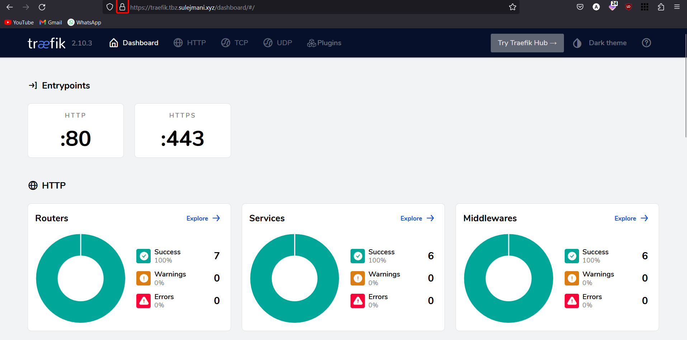

Wie auf diesem Bild zu sehen ist, funktioniert Traefik bei uns, und das SSL-Zertifikat funktioniert wie es sollte.

### Watchtower (Update Server)

Wie üblich erstellen wir zunächst einen Ordner für die Docker-Umgebung, in diesem Fall wieder für den einzelnen Container.

Das können wir mit folgendem Befehl tun:

```bash
mkdir watchtower
```

Dann wechseln wir in das Verzeichnis `./watchtower` mit dem Befehl `cd`.

```bash
cd watchtower
```

Hier erstellen wir erneut die Datei `docker-compose.yml`.

```bash
touch docker-compose.yml
```

Nun können wir die Datei definieren, damit Watchtower so funktioniert, wie wir es wollen.

```bash
vim docker-compose.yml # oder nano
```

```yml
version: "3.8"
services:
  watchtower:
    image: containrrr/watchtower:latest
    container_name: watchtower
    networks:
      proxy:
        ipv4_address: 172.16.1.1
    environment:
      - TZ=Europe/Zurich # Zeitzone
      - WATCHTOWER_INCLUDE_STOPPED=true # Container die deaktiviert sind werden auch updated.
      - WATCHTOWER_REVIVE_STOPPED=false # Container die deaktiviert sind werden nicht wieder gestartet nach dem restart
      - WATCHTOWER_RUN_ONCE=false # Dies muss gesetzt werden, damit man einen Schedule einsetzen kann.
      - WATCHTOWER_CLEANUP=true # Alte Images werden gelöscht
      - WATCHTOWER_SCHEDULE=0 0 20 * * 5 # Schedule für jeden Freitag um 20:00
    volumes:
      - /var/run/docker.sock:/var/run/docker.sock
    restart: on-failure

networks: # Netzwerk definieren, damit es im gleichen Netzwerk ist, wie die anderen Container.
  proxy:
    external: true
```

Ich habe diese Datei zusammengestellt und werde sie auch für unsere Docker-Umgebung benötigen.

Sobald wir die Datei gespeichert haben, können wir sie direkt starten.

```bash
docker compose up -d
```

Um zu überprüfen, ob alles funktioniert hat, können wir die Logs anzeigen lassen. Dies können wir mit folgendem Befehl tun:

```bash
docker compose logs -f
```

```bash
level=info msg="Watchtower 1.7.1"
level=info msg="Using no notifications"
level=info msg="Checking all containers (except explicitly disabled with label)"
level=info msg="Scheduling first run: 2024-02-02 20:00:00 +0100 CET"
level=info msg="Note that the first check will be performed in 120 hours, 9 minutes, 40 seconds"
```

Wir sehen, dass alles funktioniert hat, wenn wir keine Fehlermeldungen sehen und Watchtower uns mitteilt, wann das nächste Update durchgeführt wird.

### OwnCloud (Share und Sync Server)

#### Installation

Nachdem wir bereits alle notwendigen Ordner mit dem vorherigen Skript erstellt haben, müssen wir jetzt zum Verzeichnis `./docker/owncloud` wechseln und dort zwei Dateien erstellen: `.env` und `docker-compose.yml`.

```bash
cd owncloud
```

```bash
touch .env docker-compose.yml
```

In der Datei `docker-compose.yml` fügen wir folgenden Inhalt ein:

```yml
version: "3"

services:

  owncloud:
    image: owncloud/server:${OWNCLOUD_VERSION}
    container_name: owncloud-server
    networks:
      proxy:
        ipv4_address: 172.16.3.1
    restart: always
    labels:
      - traefik.enable=true
      - traefik.http.routers.owncloud.entrypoints=http
      - traefik.http.routers.owncloud.rule=Host(`owncloud.tbz.domain.tld`) # Hier mit deiner eigenen Domain ersetzen
      - traefik.http.middlewares.owncloud-https-redirect.redirectscheme.scheme=https
      - traefik.http.routers.owncloud.middlewares=owncloud-https-redirect
      - traefik.http.routers.owncloud-secure.entrypoints=https
      - traefik.http.routers.owncloud-secure.rule=Host(`owncloud.tbz.domain.tld`) # Hier mit deiner eigenen Domain ersetzen
      - traefik.http.routers.owncloud-secure.tls=true
      - traefik.http.routers.owncloud-secure.service=owncloud
      - traefik.http.services.owncloud.loadbalancer.server.port=8080 # Port 8080 vom Container auf Port 80 von Traefik weiterleiten
      - traefik.docker.network=proxy
    depends_on: # OwnCloud startet erst, wenn mariadb und redis funktionieren
      - mariadb
      - redis
    environment:
      - OWNCLOUD_DOMAIN=${OWNCLOUD_DOMAIN}
      - OWNCLOUD_TRUSTED_DOMAINS=${OWNCLOUD_TRUSTED_DOMAINS}
      - OWNCLOUD_DB_TYPE=mysql
      - OWNCLOUD_DB_NAME=owncloud
      - OWNCLOUD_DB_USERNAME=owncloud
      - OWNCLOUD_DB_PASSWORD=owncloud
      - OWNCLOUD_DB_HOST=mariadb
      - OWNCLOUD_ADMIN_USERNAME=${ADMIN_USERNAME}
      - OWNCLOUD_ADMIN_PASSWORD=${ADMIN_PASSWORD}
      - OWNCLOUD_MYSQL_UTF8MB4=true
      - OWNCLOUD_REDIS_ENABLED=true
      - OWNCLOUD_REDIS_HOST=redis
    healthcheck:
      test: ["CMD", "/usr/bin/healthcheck"]
      interval: 30s
      timeout: 10s
      retries: 5
    volumes:
      - ./data:/mnt/data

  mariadb: # Standard MariaDB Umgebung für OwnCloud
    image: mariadb:10.11 # Mindestens erforderliche ownCloud-Version ist 10.9
    container_name: owncloud-mariadb
    networks:
      proxy:
        ipv4_address: 172.16.3.2
    restart: always
    environment:
      - MYSQL_ROOT_PASSWORD=owncloud
      - MYSQL_USER=owncloud
      - MYSQL_PASSWORD=owncloud
      - MYSQL_DATABASE=owncloud
      - MARIADB_AUTO_UPGRADE=1
    command: ["--max-allowed-packet=128M", "--innodb-log-file-size=64M"]
    healthcheck:
      test: ["CMD", "mysqladmin", "ping", "-u", "root", "--password=owncloud"]
      interval: 10s
      timeout: 5s
      retries: 5
    volumes:
      - ./mysql:/var/lib/mysql

  redis: # Standard Redis-Umgebung für OwnCloud
    image: redis:6
    container_name: owncloud-redis
    networks:
      proxy:
        ipv4_address: 172.16.3.3
    restart: always
    command: ["--databases", "1"]
    healthcheck:
      test: ["CMD", "redis-cli", "ping"]
      interval: 10s
      timeout: 5s
      retries: 5
    volumes:
      - ./redis:/data

networks: # Proxy-Netzwerk, damit Traefik funktioniert
  proxy:
    external: true
```

In die `.env` Datei fügen wir dies ein:

```bash
OWNCLOUD_VERSION=latest # nicht ändern
OWNCLOUD_DOMAIN=localhost:8080 # Mit deiner eigenen Domain anpassen
OWNCLOUD_TRUSTED_DOMAINS=localhost:8080 # Mit deiner eigenen Domain anpassen
ADMIN_USERNAME=admin # nicht ändern
ADMIN_PASSWORD=admin # nicht ändern
HTTP_PORT=8080 # nicht ändern
```

Sobald dies erledigt ist, können wir die Umgebung starten und zu `owncloud.tbz.domain.tld` gehen, in meinem Fall `owncloud.tbz.sulejmani.xyz`.

```bash
docker-compose up -d
```

#### Konfiguration

##### Admin-Passwort ändern

Jetzt befinden wir uns im OwnCloud-Webinterface. Falls wir die Traefik-Tags richtig gesetzt haben, werden wir über HTTPS darauf zugreifen können.

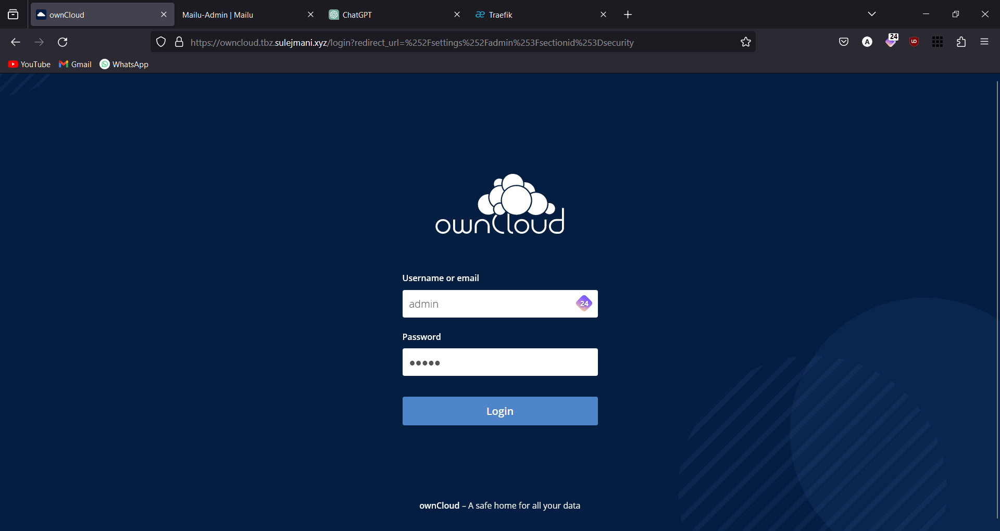

Falls alles wie erwartet funktioniert, können wir uns jetzt anmelden. Verwenden Sie die Anmeldedaten aus der `.env`-Datei. In meinem Fall:

- **Benutzername**: admin
- **Passwort**: admin

Nachdem wir angemeldet sind, sollten wir das Passwort jedoch sofort ändern.

Klicken Sie dazu oben rechts auf Ihren Benutzernamen und wählen Sie "Benutzer".

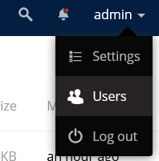

Sobald wir hier sind, sehen wir unseren Admin-Benutzer und ändern sein Passwort.

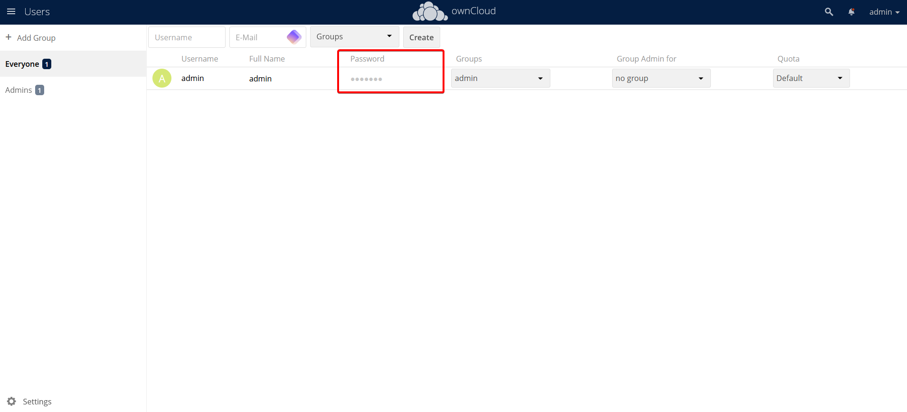

##### Benutzer erstellen

Die Benutzer können im selben Tab erstellt werden.

Klicken Sie erneut oben rechts auf Ihren Benutzernamen und wählen Sie "Benutzer".


Sobald wir hier sind, sehen wir unseren Admin-Benutzer und können oben neue Benutzer erstellen.

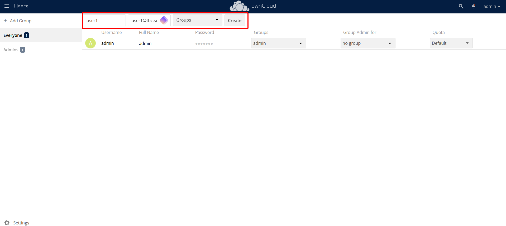

Ich werde 6 Benutzer erstellen:

| Benutzername | Passwort | E-Mail                  | Gruppen |
| ------------ | -------- | ----------------------- | ------- |
| user1        | password | user1@tbz.sulejmani.xyz | Users   |
| user2        | password | user2@tbz.sulejmani.xyz | Users   |
| user3        | password | user3@tbz.sulejmani.xyz | Users   |
| user4        | password | user4@tbz.sulejmani.xyz | Users   |
| user5        | password | user5@tbz.sulejmani.xyz | Users   |
| user6        | password | user6@tbz.sulejmani.xyz | Users   |

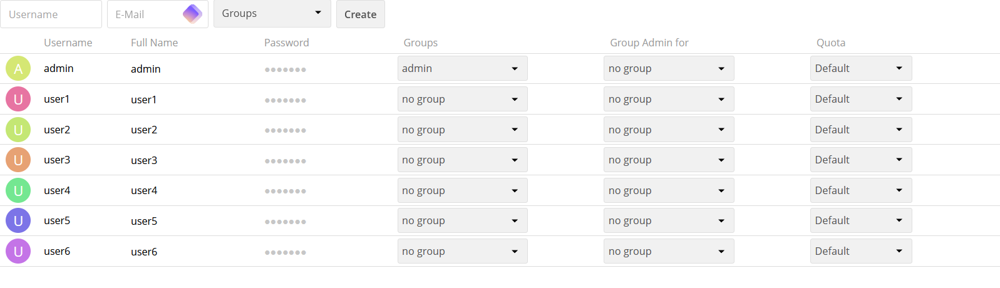

##### Server-seitige Verschlüsselung

Um sicherzustellen, dass unsere Daten zuverlässig gespeichert werden, benötigen wir eine zuverlässige serverseitige Verschlüsselung. Dies bedeutet, dass alle unsere Dateien im Hintergrund verschlüsselt gespeichert werden. Benutzer müssen nichts einstellen, da alles im Backend erfolgt. Dies erleichtert auch die zukünftige Sicherung der Daten, da sie bereits verschlüsselt sind.

Um dies einzustellen, navigieren wir zuerst zu "Einstellungen" (Settings) und dann zu "Verwaltung > Verschlüsselung" (Admin > Encryption).

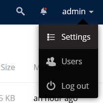

Dort aktivieren wir die serverseitige Verschlüsselung.

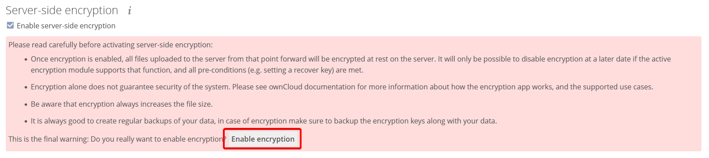

Das Aktivieren des Häkchens reicht jedoch nicht aus. Wir müssen auch das Modul aktivieren. Dies kann unter "Verwaltung > Apps" (Admin > Apps) erfolgen.

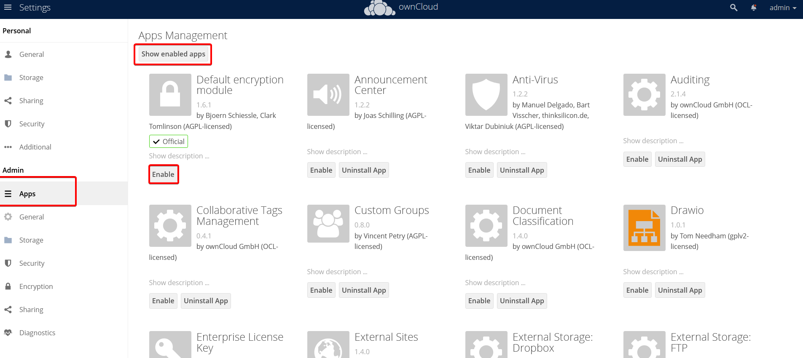

Hier suchen und aktivieren wir das "Default encryption module".

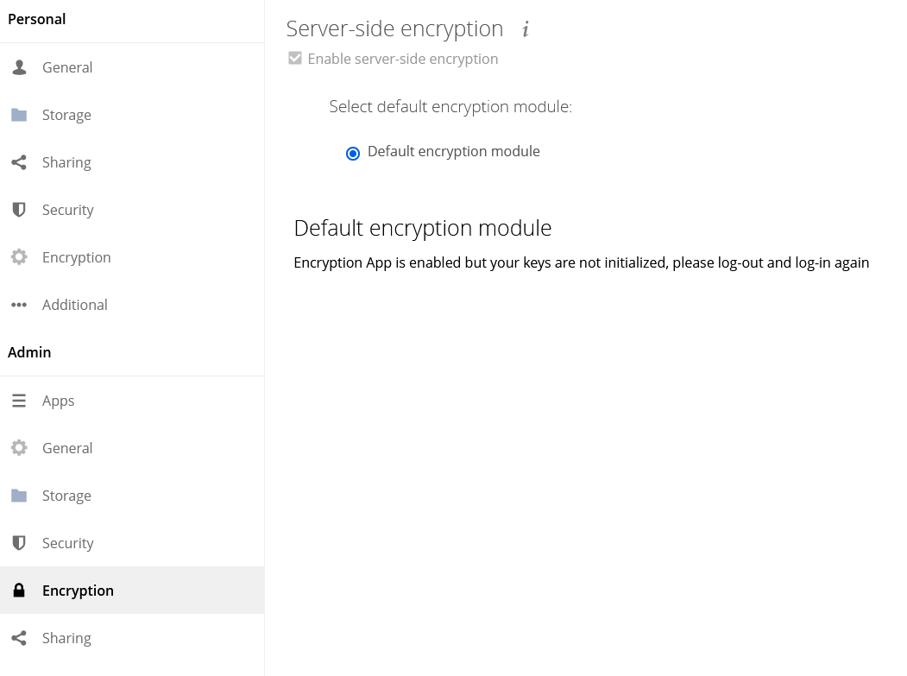

Jetzt sehen wir unter "Verwaltung > Verschlüsselung" (Admin > Encryption), dass das "Default encryption module" verwendet wird.

##### 2FA für den Admin-Benutzer

Unser Admin-Benutzer ist besonders sicherheitskritisch, daher reicht eine einfache Ein-Faktor-Authentifizierung (1FA) nicht aus. Daher installieren wir ein Add-On, um die Zwei-Faktor-Authentifizierung (2FA) zu aktivieren, insbesondere die TOTP-Methode. TOTP generiert alle 30 Sekunden einen 6-stelligen Code basierend auf einem "Passwort".

Zuerst gehen wir oben links zu "Einstellungen" (Settings) und dann zum "Markt" (Market).

Sobald wir dort sind, suchen wir nach einem Add-On namens "2-Factor Authentication".

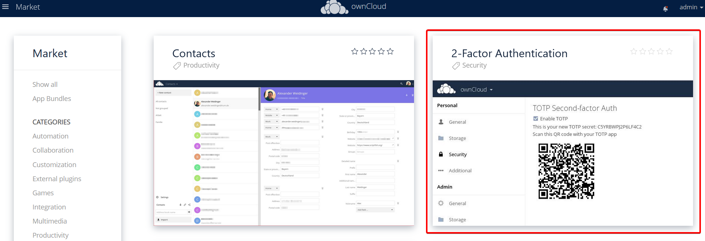

Sobald wir es gefunden haben, klicken wir darauf und installieren es.

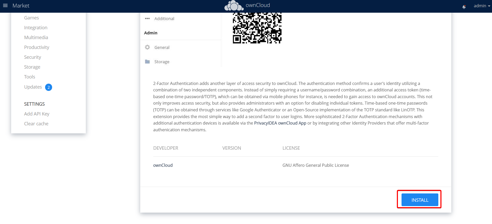

Jetzt haben wir es installiert, müssen es aber noch einrichten. Dafür gehen wir zurück zu "Einstellungen" (Settings) oben rechts.


Dann gehen wir zu "Persönlich > Sicherheit" (Personal > Security) und richten TOTP ein, verwenden Sie dazu einen Passwort-Manager Ihrer Wahl, in meinem Fall Proton Pass.

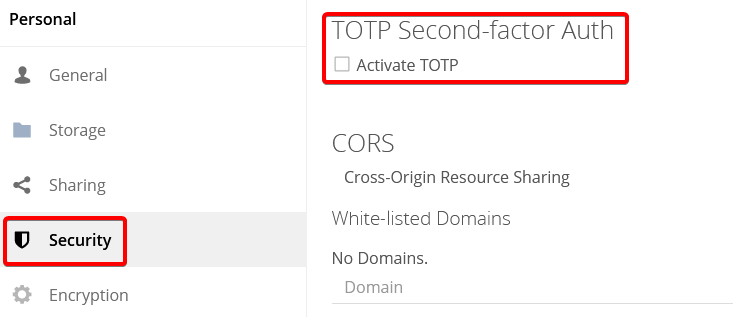

### Mailu (Mail Server)

#### Installation

Der letzte Dienst, den wir jetzt installieren, ist der Mail-Server. Ich habe mich für Mailu entschieden, da es im Vergleich zu MailCow sehr leistungsfähig ist.

Mit dem Skript `prerequisite.sh` haben wir bereits alle erforderlichen Ordner erstellt. Jetzt müssen wir nur noch zwei Dateien herunterladen.

Lade die Dateien [docker/mailu/docker-compose.yml](./docker/mailu/docker-compose.yml) und [docker/mailu/mailu.env](./docker/mailu/mailu.env) herunter.

Bevor wir fortfahren, müssen wir jedoch einige Anpassungen vornehmen.

```bash
cd mailu
```

```bash
wget https://raw.githubusercontent.com/Arlind-tbz/modul-143/main/docker/mailu/docker-compose.yml?token=GHSAT0AAAAAACIIHYV4HPHTC4GJEMIRUHR2ZNX44XQ
wget https://raw.githubusercontent.com/Arlind-tbz/modul-143/main/docker/mailu/mailu.env?token=GHSAT0AAAAAACIIHYV4XCG2MCFHL7WETPRUZNX44YQ
```

Mit einem Texteditor wie Vim oder Nano können wir nun unsere Dateien anpassen. Fangen wir mit der `mailu.env`-Datei an.

```bash
vim mailu.env
```

Finde die Werte `SUBNET`, `DOMAIN`, `HOSTNAMES` und `POSTMASTER` und passe sie an, wie in den Beispielen unten gezeigt:

```bash
SUBNET=172.21.0.0/16, 172.16.0.0/16 # Nicht verändern
DOMAIN=tbz.sulejmani.xyz # Mit deiner Domain anpassen
HOSTNAMES=mail.tbz.sulejmani.xyz, 172.16.2.1, tbz.sulejmani.xyz # Mit deiner Domain anpassen
POSTMASTER=admin # Nicht verändern
```

Jetzt zur `docker-compose.yml`-Datei.

```bash
vim docker-compose.yml
```

Im Container `front:` musst du die Labels anpassen, damit es mit deiner Domain in Traefik funktioniert.

```yml
  front:
    image: ${DOCKER_ORG:-ghcr.io/mailu}/${DOCKER_PREFIX:-}nginx:${MAILU_VERSION:-2.0}
    container_name: mailu-front
    restart: always
    env_file: mailu.env
    logging:
      driver: journald
      options:
        tag: mailu-front
    ports:
      - "25:25"
      - "465:465"
      - "587:587"
      - "110:110"
      - "995:995"
      - "143:143"
      - "993:993"
    labels:
      - traefik.enable=true
      - traefik.http.routers.mail.entrypoints=http
      - traefik.http.routers.mail.rule=Host(`mail.tbz.domain.tld`) # Mit deiner Domain anpassen
      - traefik.http.middlewares.mail-https-redirect.redirectscheme.scheme=https
      - traefik.http.routers.mail.middlewares=mail-https-redirect
      - traefik.http.routers.mail-secure.entrypoints=https
      - traefik.http.routers.mail-secure.rule=Host(`mail.tbz.domain.tld`) # Mit deiner Domain anpassen
      - traefik.http.routers.mail-secure.tls=true
      - traefik.http.routers.mail-secure.service=mail
      - traefik.http.services.mail.loadbalancer.server.port=80
      - traefik.docker.network=proxy
    networks:
      proxy:
        ipv4_address: 172.16.2.1
      mail:
    volumes:
      - "./mailu/certs:/certs"
      - "./mailu/overrides/nginx:/overrides:ro"
```

Sobald wir das erledigt haben, können wir die Umgebung starten und den Admin-Benutzer erstellen.

```bash
docker compose up -d
```

Jetzt können wir das testen, indem wir zu deiner Domain gehen. Bevor wir fortfahren, müssen wir jedoch den Admin-Benutzer erstellen. In Mailu erfolgt dies über einen `docker compose execute`-Befehl. Wir erstellen einen Admin-Benutzer mit dem Namen `admin@tbz.sulejmani.xyz` und dem Passwort "password".

```bash
docker compose exec admin flask mailu admin admin tbz.sulejmani.xyz 'password'
```

```
created admin user
```

Jetzt haben wir den Admin-Benutzer erstellt und können uns im Webinterface für das Admin-Portal anmelden.

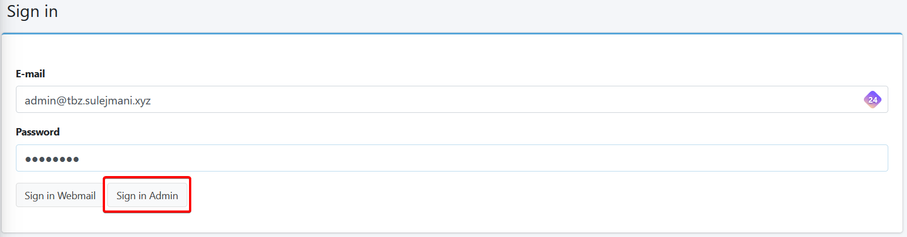

#### Konfiguration

##### Einstellung des Anzeigenamens und Deaktivierung des Spamfilters

Im Admin-Interface können wir jetzt den Spamfilter deaktivieren und einen Anzeigenamen festlegen.

**Warum deaktivieren wir den Spamfilter?**

Wir deaktivieren den Spamfilter, um die Systemleistung zu schonen. Der Hauptgrund dafür ist jedoch, dass wir ihn nicht benötigen. Unsere Mail-Instanz ist lokal und dient nur für interne Kommunikation. Wir können keine E-Mails von extern empfangen oder nach aussen senden. Dies ist eine spezielle Anforderung von Sota GmbH für diesen Anwendungsfall.

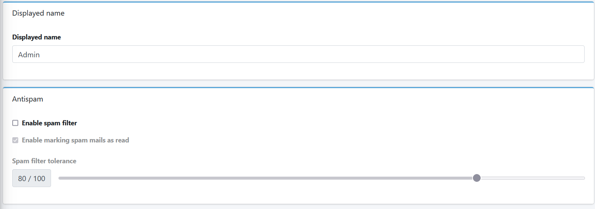

Um den Spamfilter zu deaktivieren, entfernen wir einfach das Häkchen.

Währenddessen können wir oben auch unseren Anzeigenamen festlegen.

##### Ändern des Admin-Passworts

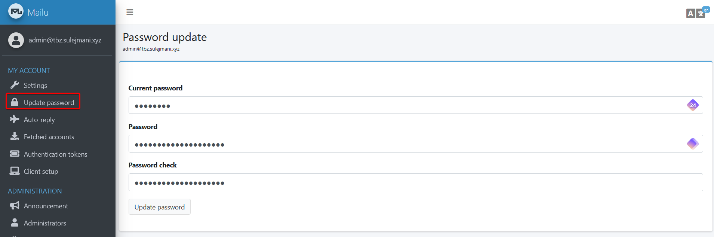

Unter `My Account > Update password` können wir unser Passwort ändern.

##### Erstellung von Benutzern

Basierend auf der Liste von OwnCloud werde ich für jeden Benutzer eine E-Mail-Adresse erstellen:

| Benutzername | Passwort | E-Mail                  |
| ------------ | -------- | ----------------------- |
| user1        | password | user1@tbz.sulejmani.xyz |
| user2        | password | user2@tbz.sulejmani.xyz |
| user3        | password | user3@tbz.sulejmani.xyz |
| user4        | password | user4@tbz.sulejmani.xyz |
| user5        | password | user5@tbz.sulejmani.xyz |
| user6        | password | user6@tbz.sulejmani.xyz |

Die Passwörter sind sehr einfach, da jeder Benutzer sein Passwort nach der Erstellung ändern muss.

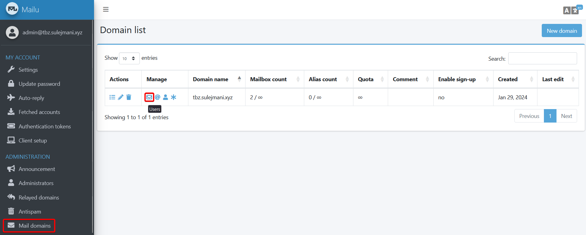

Um Benutzer zu erstellen, gehen wir zu `Administration > Mail Domains` und wählen unsere Domain aus. Dann können wir weitere Benutzer hinzufügen und auf das Briefsymbol klicken, um zur Benutzerliste zu gelangen.

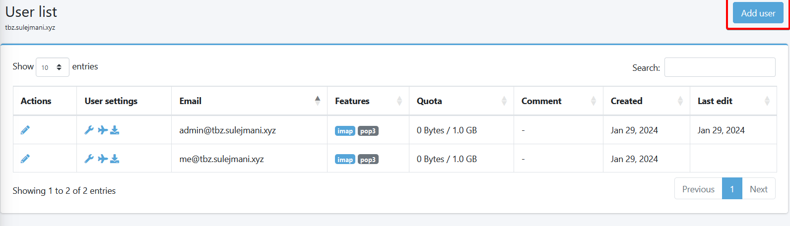

Oben rechts können wir neue Benutzer erstellen.

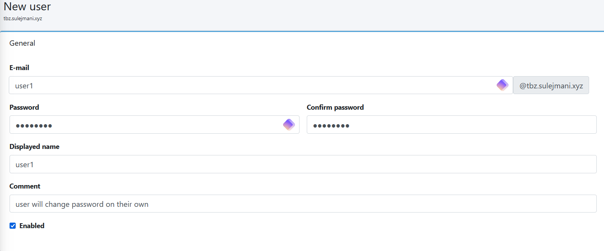

Hier ist ein Beispiel, wie ich einen Benutzer erstelle. Dies habe ich für die restlichen 5 Benutzer genauso gemacht und bin zu diesem Ergebnis gekommen:

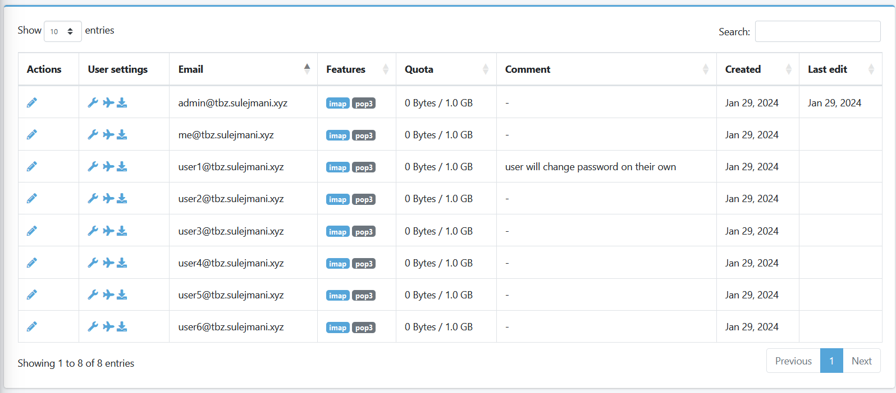

### Backup und Restore

#### Rsync

Rsync ist wie ein kluges Tool, mit dem du Dateien von einem Ort zum anderen verschieben und synchronisieren kannst. Es ist besonders hilfreich, wenn du sicherstellen möchtest, dass deine Dateien immer aktuell sind, sei es auf deinem Computer oder auf einem anderen. Standardmässig wird das erste Backup ein Vollbackup sein, und alle nachfolgenden Backups werden inkrementell sein.

Wir benötigen zwei Befehle: einen zum lokalen Speichern von Daten an einem anderen Ort und einen weiteren für ein Offsite-Backup.

1. `rsync -avh --delete "$source_dir" "$local_backup_dir1"`

   - Mit diesem Befehl kopierst du Dateien von einem Ort (den du in der Variable `$source_dir` festlegst) zu einem anderen Ort (den du in `$local_backup_dir1` festlegst). Dabei werden alle wichtigen Informationen wie Besitzer, Berechtigungen usw. beibehalten.
   - Die Option `--delete` sorgt dafür, dass Dateien im Zielverzeichnis gelöscht werden, wenn sie im Quellverzeichnis nicht mehr vorhanden sind. So wird sichergestellt, dass beide Verzeichnisse immer auf dem gleichen Stand sind.

2. `rsync -avh --delete -e "ssh -i /home/arlind/.ssh/ssh-key" "$source_dir" "$remote_user@$remote_host:$remote_backup_dir"`

   - Dieser Befehl macht im Grunde dasselbe wie der erste, aber er kopiert Dateien von deinem Computer zu einem anderen Computer über das Internet (oder ein Netzwerk).
   - Die Option `-e` gibt an, dass du SSH verwenden möchtest, um die Dateien sicher zu übertragen. SSH ist wie eine verschlüsselte Tunnelverbindung zwischen den beiden Computern.
   - Der Pfad zum privaten SSH-Schlüssel wird mit `-i` angegeben, um sicherzustellen, dass du dich auf dem anderen Computer authentifizieren kannst.
   - `$source_dir` ist das Verzeichnis, das du kopieren möchtest.
   - `$remote_user@$remote_host:$remote_backup_dir` gibt an, wohin die Dateien auf dem anderen Computer kopiert werden sollen. `$remote_user` ist der Benutzername auf dem anderen Computer, `$remote_host` ist die Adresse des anderen Computers (IP-Adresse oder Domain), und `$remote_backup_dir` ist das Zielverzeichnis auf dem anderen Computer.

#### Backup-Skript

Nach zahlreichen Versuchen habe ich dieses Skript entwickelt:

```bash
#!/bin/bash
timestamp=$(date +%Y_%m_%d-%H_%M_%S)
log_dir="/var/log/tbz"
log_file1="$log_dir/${timestamp}_backup-hdd.log"
log_file2="$log_dir/${timestamp}_backup-tape.log"
log_file_remote="$log_dir/${timestamp}_backup-remote.log"
mkdir -p "$log_dir"
source_dir="/home/arlind/docker/"
local_backup_dir1="/home/arlind/backup-hdd"  # HDD
local_backup_dir2="/home/arlind/backup-tape" # Tape

# Erste lokale Sicherung mit rsync durchführen und Ausgabe protokollieren
rsync -avh --delete "$source_dir" "$local_backup_dir1" > "$log_file1" 2>&1

# Zweite lokale Sicherung mit rsync durchführen und Ausgabe protokollieren
rsync -avh --delete "$source_dir" "$local_backup_dir2" > "$log_file2" 2>&1

# Remote-Sicherungsziel (Offsite) festlegen
remote_user="arlind"
remote_host="localhost"
remote_backup_dir="/home/arlind/backup-remote"

# Remote-Sicherung mit rsync über SSH durchführen und Ausgabe protokollieren
rsync -avh --delete -e "ssh -i /home/arlind/.ssh/ssh-key" "$source_dir" "$remote_user@$remote_host:$remote_backup_dir" > "$log_file_remote" 2>&1
```

Mit diesem Skript sichere ich alles im Verzeichnis `~/docker` und sende es an drei verschiedene Orte: einmal auf einer HDD und einem Tape, sowie über SSH an einen Offsite-Server (Cloud).

Diese Orte sind rein theoretisch, ebenso wie der Cloud-Server und die beiden Festplatten, die auf meiner NVMe-Disk liegen. Dennoch könnte ich mit dieser Methode das Skript ausführen, wenn ich die entsprechende Hardware oder Cloud-Instanz hätte.

Das Skript erfordert `sudo`-Rechte, um ausgeführt zu werden, da verschiedene Docker-Container, insbesondere Datenbankcontainer, ihre Daten mit speziellen Berechtigungen speichern. Dies ist jedoch kein Problem, da Cron-Jobs Skripte als `root` ausführen können. Falls ein Systemadministrator ein manuelles Backup durchführen muss, kann er dies problemlos durch Ausführen des folgenden Befehls tun:

```bash
sudo bash backup.sh
```

Hier ist der Cron-Job, der täglich um 20:00 Uhr ausgelöst wird:

```bash
0 20 * * * /bin/bash /home/arlind/docker/backup.sh
```

Die Logs sind wie gewohnt unter `/var/log/tbz` zu finden.

#### Restore-Skript

Für das Restore-Skript habe ich insgesamt drei Skripte benötigt.

Zuerst ein Skript, um alle relevanten Container herunterzufahren, dann ein Skript, um alle Container wieder hochzufahren, und schliesslich das Restore-Skript selbst.

Hier sind die erstellten Skripte:

**stop.sh**

```bash
#!/bin/bash

# Funktion, um zu überprüfen, ob eine Datei existiert
file_exists() {
  if [ -f "$1" ]; then
    return 0  # Datei existiert
  else
    return 1  # Datei existiert nicht
  fi
}

# Pfade zu den Docker-Compose-Dateien
mailu_compose="/home/arlind/docker/mailu/docker-compose.yml"
owncloud_compose="/home/arlind/docker/owncloud/docker-compose.yml"
traefik_compose="/home/arlind/docker/traefik/docker-compose.yml"
watchtower_compose="/home/arlind/docker/watchtower/docker-compose.yml"

# Überprüfen, ob jede Datei existiert, und das entsprechende Docker-Compose stoppen, wenn ja
if file_exists "$mailu_compose"; then
  sudo docker-compose -f "$mailu_compose" down
fi

if file_exists "$owncloud_compose"; then
  sudo docker-compose -f "$owncloud_compose" down
fi

if file_exists "$traefik_compose"; then
  sudo docker-compose -f "$traefik_compose" down
fi

if file_exists "$watchtower_compose"; then
  sudo docker-compose -f "$watchtower_compose" down
fi
```

**start.sh**

```bash
#!/bin/bash

# Funktion, um zu überprüfen, ob eine Datei existiert
file_exists() {
  if [ -f "$1" ]; then
    return 0  # Datei existiert
  else
    return 1  # Datei existiert nicht
  fi
}

# Pfade zu den Docker-Compose-Dateien
traefik_compose="/home/arlind/docker/traefik/docker-compose.yml"
watchtower_compose="/home/arlind/docker/watchtower/docker-compose.yml"
owncloud_compose="/home/arlind/docker/owncloud/docker-compose.yml"
mailu_compose="/home/arlind/docker/mailu/docker-compose.yml"

# Überprüfen, ob jede Datei existiert, und das entsprechende Docker-Compose mit bestimmten Parametern starten, wenn ja
if file_exists "$traefik_compose"; then
  docker-compose -f "$traefik_compose" up -d
fi

if file_exists "$watchtower_compose"; then
  docker-compose -f "$watchtower_compose" up -d
fi

if file_exists "$owncloud_compose"; then
  docker-compose -f "$owncloud_compose" --env-file "/home/arlind/docker/owncloud/.env" up -d
fi

if file_exists "$mailu_compose"; then
  docker-compose -f "$mailu_compose" --env-file "/home/arlind/docker/mailu/mailu.env" up -d
fi
```

**restore.sh**

```bash
#!/bin/bash

timestamp=$(date +%Y_%m_%d-%H_%M_%S)
log_dir="/var/log/tbz"
log_file1="$log_dir/${timestamp}_restore-hdd.log"
log_file2="$log_dir/${timestamp}_restore-tape.log"
log_file_remote="$log_dir/${timestamp}_restore-remote.log"

remote_user="arlind"
remote_host="localhost"
remote_backup_dir="/home/arlind/backup-remote/*"

bash /home/arlind/docker/stop.sh

echo "Wählen Sie ein Skript zum Ausführen aus:"
echo "1. Restore von HDD ausführen"
echo "2. Restore von Tape ausführen"
echo "3. Restore von Remote ausführen"
read choice

# Funktion zum Protokollieren von Nachrichten in die entsprechende Protokolldatei
log_message() {
  local log_file="$1"
  local message="$2"
  echo "$(date '+%Y-%m-%d %H:%M:%S') - $message" >> "$log_file"
}

case "$choice" in
  1)
    log_message "$log_file1" "Restore von HDD wird ausgeführt"
    rm -rf /home/arlind/docker/mailu
    rm -rf /home/arlind/docker/watchtower
    rm -rf /home/arlind/docker/owncloud
    rm -rf /home/arlind/docker/traefik
    cp -r /home/arlind/backup-hdd/* /home/arlind/docker/
    ;;
  2)
    log_message "$log_file2" "Restore von Tape wird ausgeführt"
    rm -rf /home/arlind/docker/mailu
    rm -rf /home/arlind/docker/watchtower
    rm -rf /home/arlind/docker/owncloud
    rm -rf /home/arlind/docker/traefik
    cp -r /home/arlind/backup-tape/* /home/arlind/docker/
    ;;
  3)
    log_message "$log_file_remote" "Restore von Remote wird ausgeführt"
    rm -rf /home/arlind/docker/mailu
    rm -rf /home/arlind/docker/watchtower
    rm -rf /home/arlind/docker/owncloud
    rm -rf /home/arlind/docker/traefik
    scp -r -i /home/arlind/.ssh/ssh-key "$remote_user@$remote_host:$remote_backup_dir" /home/arlind/docker/ >> "$log_file_remote" 2>&1
    ;;
  *)
    log_message "$log_file1" "Ungültige Auswahl. Bitte geben Sie 1, 2 oder 3 ein."
    ;;
esac

bash /home/arlind/docker/start.sh
```

Das Restore-Skript funktioniert wie folgt:

1. Es stoppt zuerst alle Container mit dem Skript `stop.sh`.
2. Dann wird der Benutzer aufgefordert, eine Option für die Wiederherstellung auszuwählen: von der HDD, vom Tape oder von Remote.
3. Basierend auf der Auswahl werden die entsprechenden Aktionen ausgeführt:
   - Alle vorhandenen Daten im Originalverzeichnis werden gelöscht.
   - Die Daten werden entweder von der HDD oder dem Tape mit `cp -r` wiederhergestellt oder von Remote mit `scp -r` über SSH geholt.
4. Schliesslich werden alle Container mit dem Skript `start.sh` wieder gestartet.

Nach Abschluss des Skripts sollten alle Container wiederhergestellt sein, und Sie können den Betrieb testen.

## Testen

### Szenario 1: Regelmässige Datensicherungen

- Unser Ziel ist es, täglich mindestens eine Datensicherung durchzuführen und sicherzustellen, dass diese ordnungsgemäss gespeichert wird.

Durchgeführt von Arlind Sulejmani

| Testfall: 29.01.2024    | Anforderung: Regelmässige Datensicherungen                                                                                                                                      |
| ----------------------- | ------------------------------------------------------------------------------------------------------------------------------------------------------------------------------- |
| Erwartetes Ergebnis:    | Regelmässige Datensicherungen sollten durchgeführt werden.                                                                                                                      |
| Tatsächliches Ergebnis: | Täglich wird eine Backup-Routine ausgeführt.                                                                                                                                    |
| Testschritte            | 1. Anpassung des Cronjobs, um tägliche Backups durchzuführen <br> 2. Überprüfung von Ordnern und Logs, um sicherzustellen, dass die Backups ordnungsgemäss durchgeführt wurden. |

Stimmt das tatsächliche Ergebnis mit dem erwarteten Ergebnis überein?
- [X] Ja

#### Beweise

##### Crontab

Um dies zu testen, habe ich zuerst den crontab vom Benutzer "root" überprüft:

```bash
sudo su -  # Wechseln zu "root"
cat /var/spool/cron/crontabs/root
```

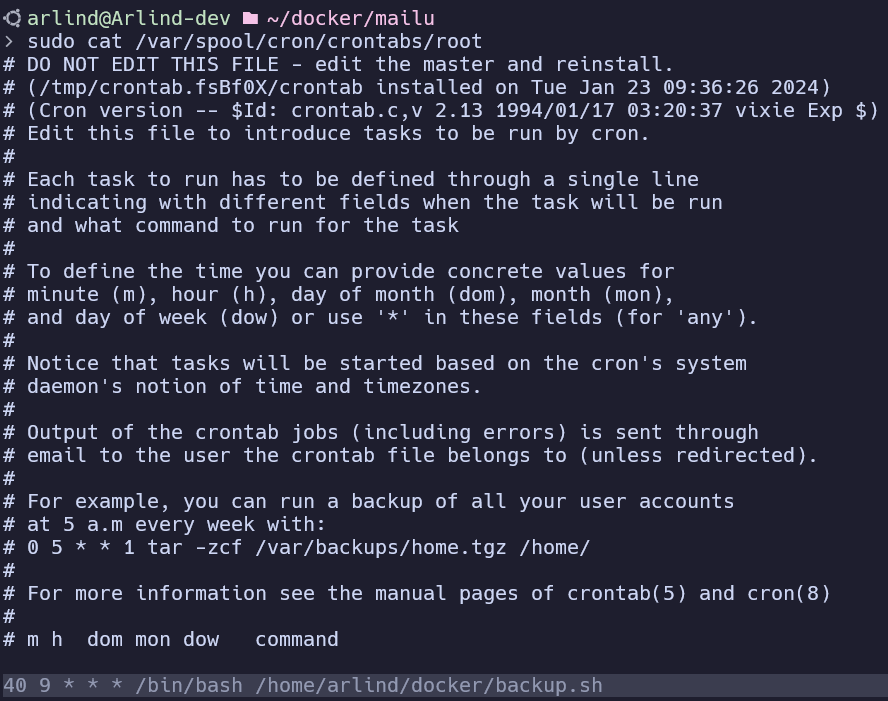

##### Logs

Um sicherzustellen, dass die Backups tatsächlich durchgeführt werden, habe ich die Logs überprüft. Ich habe konfiguriert, dass die Logs in das Verzeichnis `/var/log/tbz` gespeichert werden.

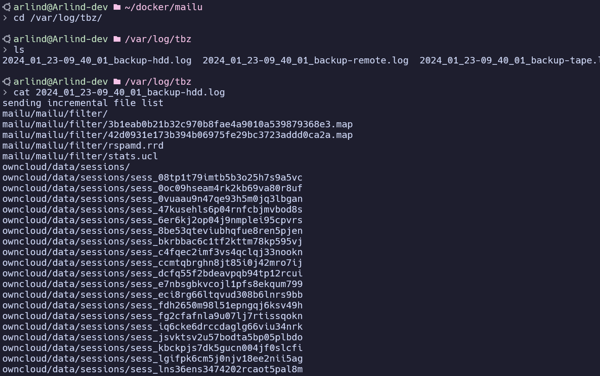

### Szenario 2: Mehrere Backup-Standorte

- Wir streben an, unsere Backups gemäss den Prinzipien des 3-2-1-Backups sicher zu speichern:
  - 3 Kopien
  - 2 auf verschiedenen Medien
  - 1 in der Cloud

Durchgeführt von Arlind Sulejmani

| Testfall: 29.01.2024    | Mehrere Backup-Standorte                                                                  |
| ----------------------- | ----------------------------------------------------------------------------------------- |
| Erwartetes Ergebnis:    | Wir sollten 3 Kopien haben, von denen 2 auf verschiedenen Medien und 1 in der Cloud sind. |
| Tatsächliches Ergebnis: | Wir haben 3 Kopien, von denen 2 auf verschiedenen Medien und 1 in der Cloud sind.         |
| Testschritte            | Überprüfung aller Cloud-Speicherorte.                                                     |

Stimmt das tatsächliche Ergebnis mit dem erwarteten Ergebnis überein?
- [X] Ja

#### Beweise

Um dies zu testen, habe ich alle Backup-Standorte überprüft. Ich habe Backups auf einer HDD, einem Tape und einem Remote-Server erstellt. Obwohl der Remote-Server auf meiner eigenen Maschine simuliert wurde, ist das Skript so konfiguriert, dass es einfach auf eine Cloud-Instanz umgestellt werden kann.

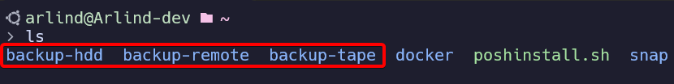

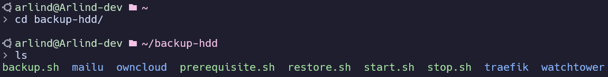

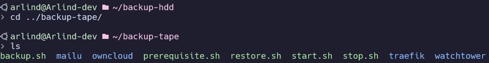

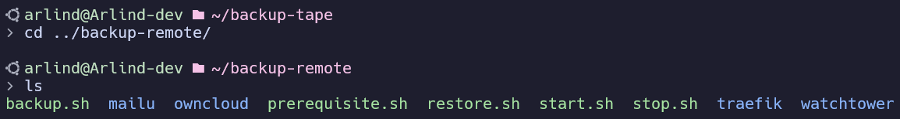

Wie aus den Screenshots ersichtlich ist, sind alle Backups vorhanden.

### Szenario 3: Verschlüsselung

- Wir legen Wert darauf, dass E-Mails und Daten sicher verschlüsselt werden. Zudem sollte unsere gesamte Umgebung vollständig über HTTPS gesichert sein.

Durchgeführt von Arlind Sulejmani

| Testfall: 29.01.2024    | Verschlüsselung                                                                                                                                                                           |
| ----------------------- | ----------------------------------------------------------------------------------------------------------------------------------------------------------------------------------------- |
| Erwartetes Ergebnis:    | Alles sollte sicher verschlüsselt sein, einschliesslich der Datenübertragung.                                                                                                             |
| Tatsächliches Ergebnis: | Alles ist sicher verschlüsselt, einschliesslich der Datenübertragung.                                                                                                                     |
| Testschritte            | Überprüfung des HTTPS-Datenverkehrs, Analyse von Containerdaten vom Hostsystem aus, Überprüfung des Backup-Skripts, um sicherzustellen, dass SSH für die Datenübertragung verwendet wird. |

Stimmt das tatsächliche Ergebnis mit dem erwarteten Ergebnis überein?
- [X] Ja

#### Beweise

##### HTTPS-Datenverkehr

Um dies zu testen, habe ich zuerst jede Website besucht und überprüft, ob die Verbindung über ein gültiges SSL-Zertifikat hergestellt wird.

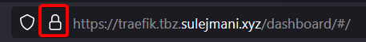

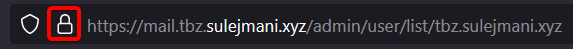

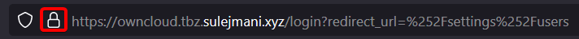

##### Backup-Skript

Um zu überprüfen, ob mein Backup-Skript die Daten sicher überträgt, habe ich das Skript analysiert, um sicherzustellen, dass SSH für die Datenübertragung verwendet wird.

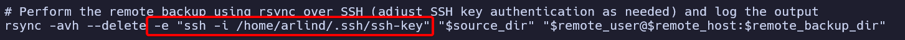

##### Docker Volumes

Es ist wichtig sicherzustellen, dass die Daten in den Docker-Volumes sicher gespeichert werden. Ich habe dies überprüft, indem ich als Root-Benutzer zum Pfad eines Benutzers gewechselt bin und die Datei mit "cat" ausgelesen habe. Das Ergebnis war eine verschlüsselte Datei.

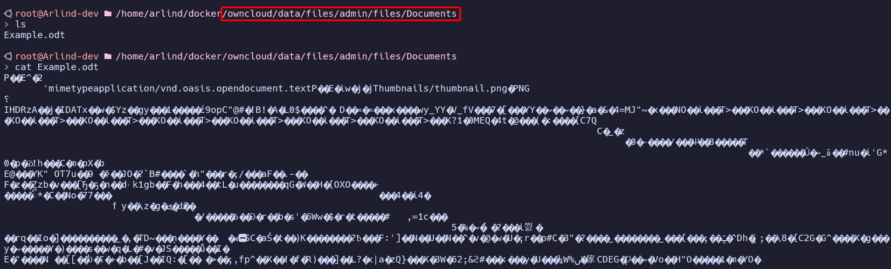

### Szenario 4: Regelmässige Updates

- Wir planen, unsere Systeme immer auf dem neuesten Stand zu halten, indem wir jeden Freitagabend um 20:00 Uhr System-Upgrades durchführen.

Durchgeführt von Arlind Sulejmani

| Testfall: 29.01.2024    | Regelmässige Updates                                                       |
| ----------------------- | -------------------------------------------------------------------------- |
| Erwartetes Ergebnis:    | Jeden Freitagabend um 20:00 Uhr sollten Systemupdates durchgeführt werden. |
| Tatsächliches Ergebnis: | Jeden Freitagabend um 20:00 Uhr werden Systemupdates durchgeführt.         |
| Testschritte            | Analyse des Watchtower-Containers und Überprüfung der Logs.                |

Stimmt das tatsächliche Ergebnis mit dem erwarteten Ergebnis überein?
- [X] Ja

#### Beweise

Um unsere Updates durchzuführen, verwenden wir Watchtower. Dies ist sehr einfach zu testen. Zuerst habe ich die Umgebung in meiner "docker-compose.yml"-Datei überprüft.

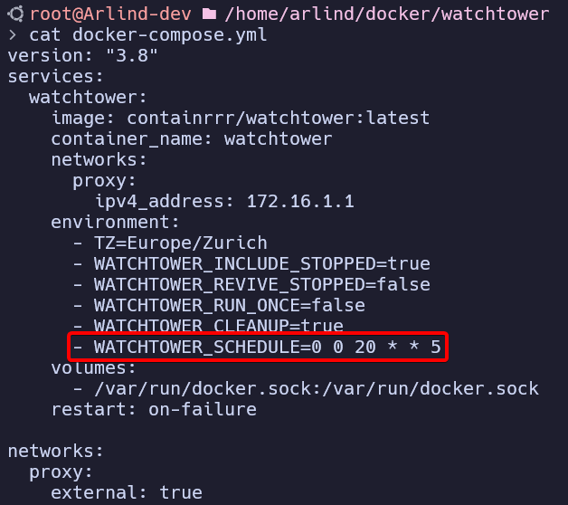

Anschliessend habe ich überprüft, ob dies auch tatsächlich funktioniert, indem ich die Logs überprüft habe. Im folgenden Bild ist zu sehen, dass am Freitag um 20:00 Uhr in unserer Zeitzone ein Upgrade geplant war.

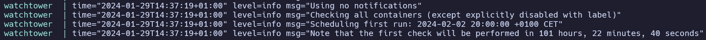

### Szenario 5: Mail-Server

- Ein funktionsfähiger Mail-Server ist für uns von Bedeutung, jedoch ausschliesslich für die interne Kommunikation.

Durchgeführt von Arlind Sulejmani

| Testfall: 29.01.2024    | Mail-Server                                                                                                  |
| ----------------------- | ------------------------------------------------------------------------------------------------------------ |
| Erwartetes Ergebnis:    | Ein sicherer Mail-Server sollte existieren, der nur interne Kommunikation erlaubt.                           |
| Tatsächliches Ergebnis: | Es existiert ein sicherer Mail-Server, der nur interne Kommunikation erlaubt.                                |
| Testschritte            | Besuch von `mail.tbz.sulejmani.xyz`, Versenden interner E-Mails und Versuch des Versendens externer E-Mails. |

Stimmt das tatsächliche Ergebnis mit dem erwarteten Ergebnis überein?
- [X] Ja

#### Beweise

##### Mails werden intern versendet

Um dies zu testen, habe ich vom Adminbenutzer eine Mail an den Benutzer "user1@tbz.sulejmani.xyz" gesendet, und diese ist problemlos angekommen.

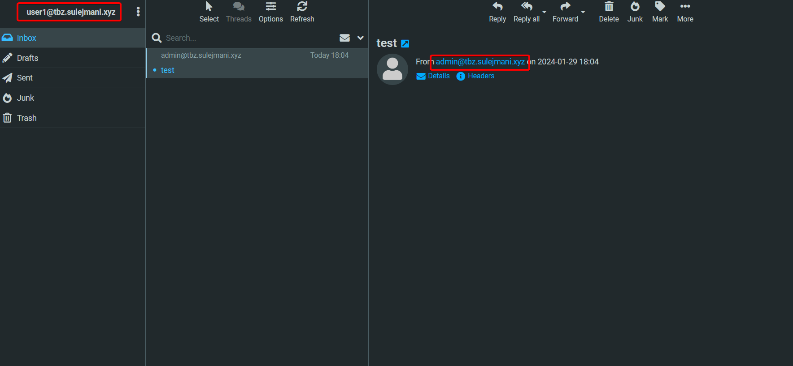

##### Mails werden nach aussen blockiert

Ich habe getestet, ob Mails erfolgreich nach aussen versendet werden können, indem ich eine E-Mail von meinem Adminbenutzer an meine private Gmail-Adresse geschickt habe. Diese E-Mail ist nicht angekommen, wie im Use-Case beschrieben.

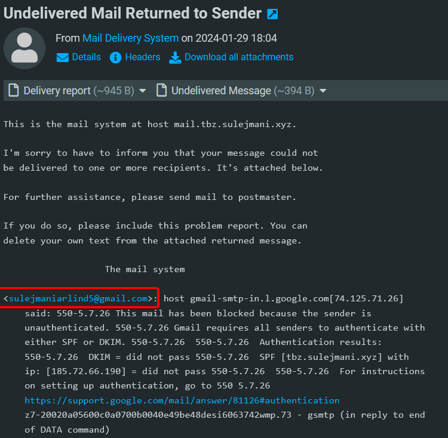

### Szenario 6: Dokumentation

- Wir benötigen eine umfassende Dokumentation, die erläutert, wie Sie alle Aufgaben ausgeführt haben, und wie wir alles nutzen können, einschliesslich der Synchronisierung und gemeinsamen Nutzung von Dateien sowie des E-Mail-Programms.

Durchgeführt von Arlind Sulejmani

| Testfall: 29.01.2024    | Dokumentation                                                                                       |
| ----------------------- | --------------------------------------------------------------------------------------------------- |
| Erwartetes Ergebnis:    | Es sollte eine Betriebsdokumentation existieren, die von Systemadministratoren genutzt werden kann. |
| Tatsächliches Ergebnis: | Es existiert eine Betriebsdokumentation für Systemadministratoren.                                  |
| Testschritte            | [Betriebsdokumentation](./Betriebsdokumentation.md)                                                 |

Stimmt das tatsächliche Ergebnis mit dem erwarteten Ergebnis überein?
- [X] Ja

#### Beweise

Ich habe eine umfassende Betriebsdokumentation erstellt, die allen zukünftigen Systemadministratoren als Leitfaden dienen soll. Dies gewährleistet den reibungslosen Betrieb des Systems, selbst wenn ich durch einen Unfall ausfalle oder das Unternehmen verlasse.

Die Betriebsdokumentation ist über den folgenden Link verfügbar: [Betriebsdokumentation](./Betriebsdokumentation.md).

### Szenario 7: Kostenoptimierung

- Unsere Präferenz liegt auf kosteneffizienten Lösungen. Das schliesst die Verwendung von Zertifikaten von Let's Encrypt, zertifikatslosen Programmen und stromsparenden Anwendungen mit ein.

#### Beweise

Um zu zeigen, dass unsere Lösung effizient ist, zeige ich die Systemleistung auf meinem Laptop, der die Aufgaben mühelos bewältigt. Insgesamt werden nur 2 GiB von 8 GiB RAM und weniger als 5% CPU-Auslastung benötigt.

Diese aktuelle Umgebung könnte sogar auf einem Raspberry Pi betrieben werden, solange ausreichend Speicher vorhanden ist.

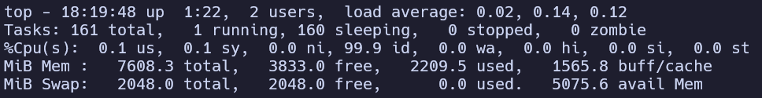
